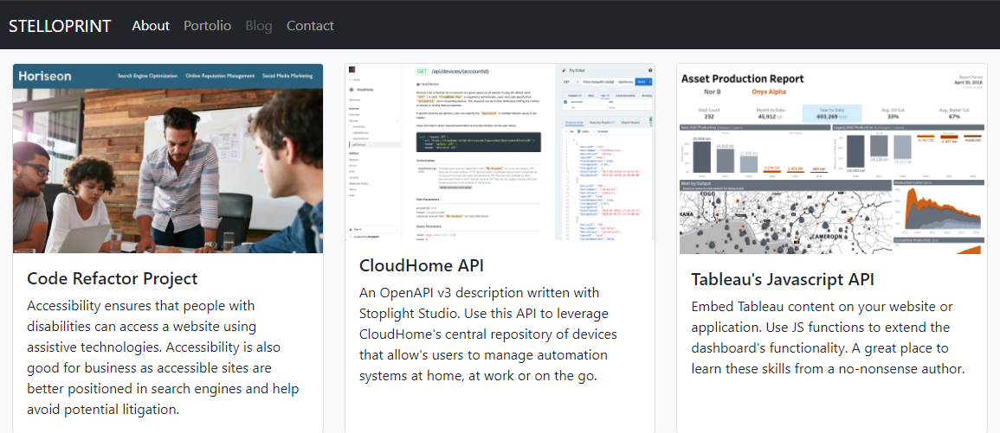

# Stephen Price's Portfolio (Stelloprint)

A responsive coding portfolio built with Bootstrap 5.

Responsive design ensures that web applications render well on a variety of devices and window or screen sizes. As a developer, you will likely be asked to create a mobile-first application or add responsive design to an existing application.

The website can be explored here: https://stephenlprice.github.io/bootstrap-portfolio/

 

